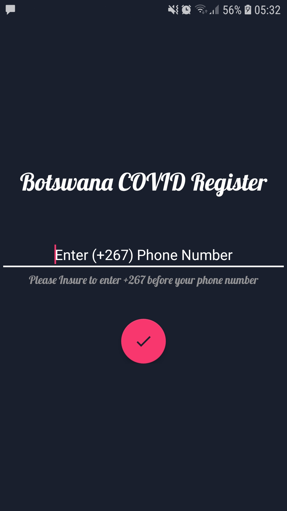
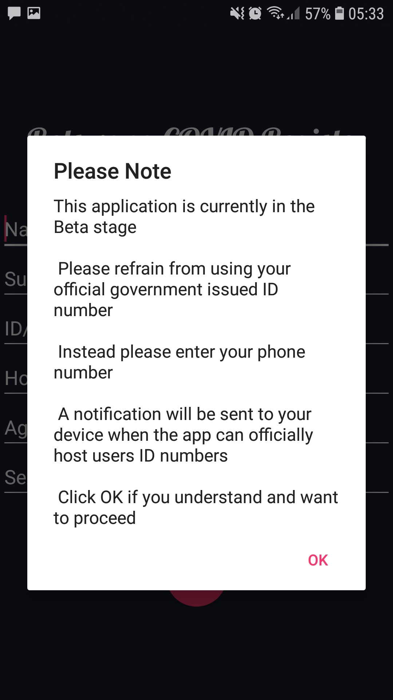

# CovidRegister
## Desgin and Implemented By Gobe Leineng Mphusu
android application written in java to take students/public registration through scanning barcode 
# How it works & features 
##### Upon successfully downloading the application and opening it the user will be greeted by the image seen below where they will be promted to enter their phone number
It is important to note the the system uses a mobile phone number to register and link user data, this is because the application has been made to register and authenticate users using their mobile number. Through studies of mobile based application that don't have a website or any other way to interact with the system and will primarily be used on the run and generally will have an on screen average time of 1 min it's best to link to a phone number because individuals would only have a phone running this application if they have an active sim card, and considering the wide range of adroid versions the system can run on it can be found that potential users might not have an active email or might not be able to view/receive emails. Also keeping the system linked to phone numbers make reregistration with a replaced sim that has the same old number will still be able to access data like location history and added location registers. 

##### This project had to go through a field test to see how it runs in a real world scenario. As a result this pop up page was put up to inform users. This was done to record crashes and also to run security checks on the database system.
During the feild study it was important that the developer (me) did not assist the users in anyway of registering and using the system, a record was made for suugestions, recommendations and issues. 
Note: the system used a sms messaging system to verify users,The user signs in using a one-time code contained in the SMS message the application was made to detect if the message arrives and auto fills the input space, if not detected the user can manually enter the code. 

##### Registration page, all feilds are complusory and carry out a datatype verification. 

##### Home Page 
Registration process of the application only appears if it is the first run of the system AND the number that has been verified is not connected to an existing account.
Scanned barcodes will be translated to text under the barcode scanner 

###### Options of function are one floating action button click away 

### Main Function
The main function of this program is it reads a location name from a barcode, prompts to enter temperature, save location details to your history and  saves your details (along with your temperature and current time) the user that created the scanned location.   
Below is an image of the first page after scanning a barcode. User will be returned to homepage automatically after entering their temperature.

### Images of floating action button functions being used
###### Settings
Currently just a function to edit user details incase a details changed or mistakes were made during registration

###### Add Location
Add a location of your own where a barcode will be generated and downloaded to the users phone to print for other users with the same application to scan and register themselves to your new location
Note: User can also have themselves registered as a location name and use their generated barcodes to register people that they meet in a non-office setting. i.e. having a business discussion at a resturant

###### View my locations register
This is to view clients who have scanned your location, the customers details have been minimized to name and time to make searching for a specific name/time easier. Clicking on the name expand to more details about the client.  
**Coming soon**
###### View my histroy 
To view locations you have scanned, here a user can only view the location name and time & date. To make individual exposer cross-checking of locations easier   

